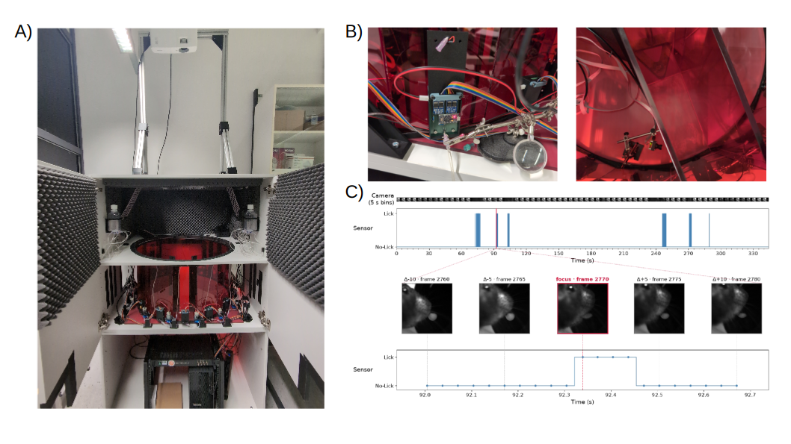
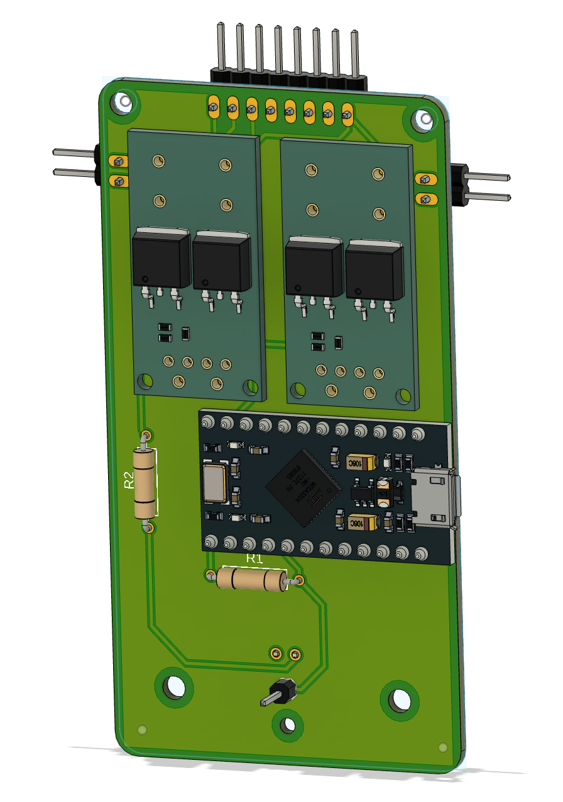
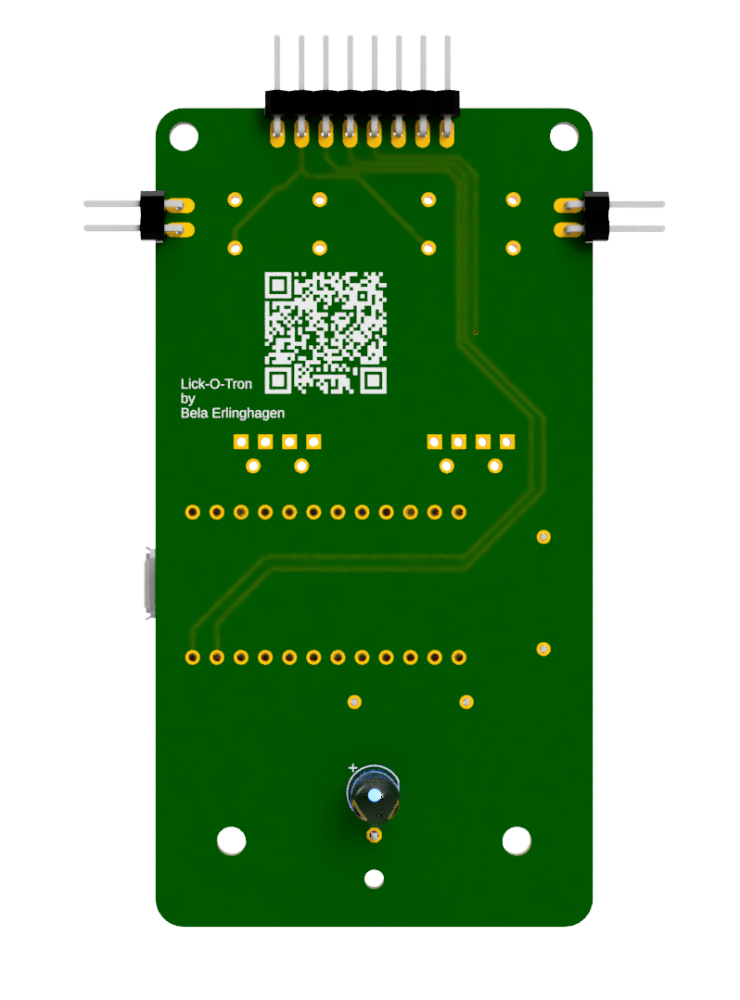
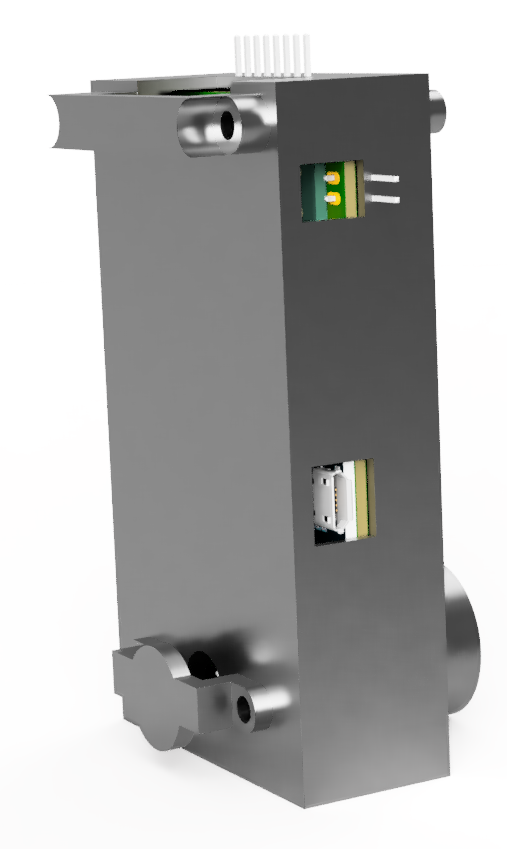
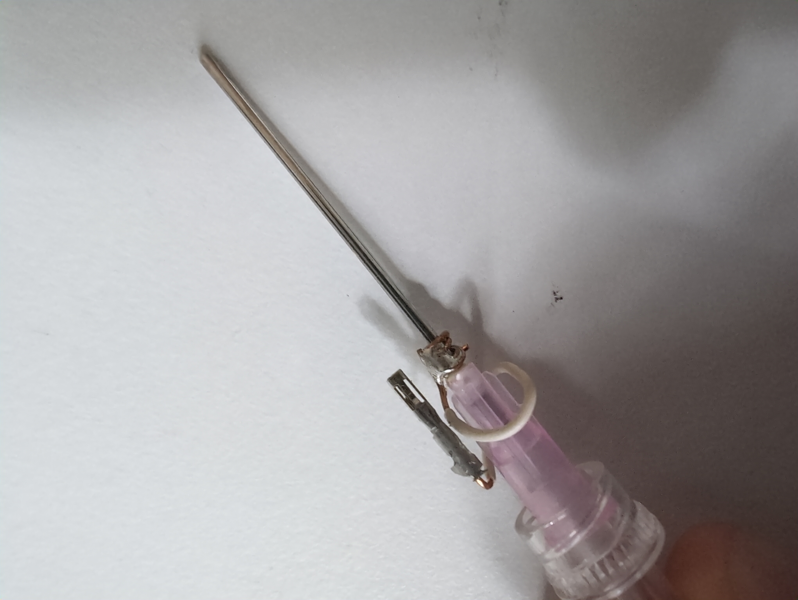
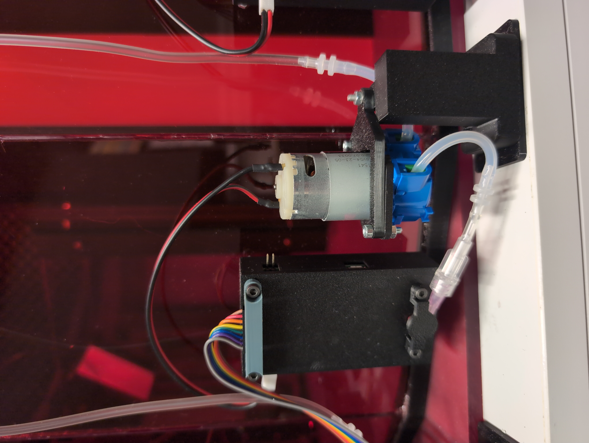
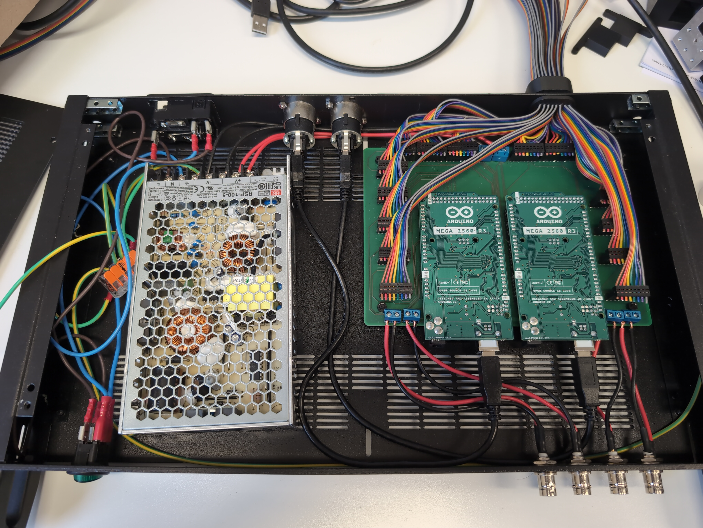

# The Multiport Setup

**A behavioral setup for mice with 16 reward ports.**

  

  <em>
    <b>Figure 1: The Multiport Setup.</b>
    <b>A)</b> Complete view of the Multiport Setup.
    <b>B)</b> Testing adjustments to the setup to show that the capacitive sensor of the Lick-O-Tron detects mouse licks.
    A Basler daA1440 was used to record the lickport. The mouse was given condensed milk (white droplet in C) manually through the shown tube.
    <b>C)</b> <i>Top:</i> Timeline over the entire session, with sensor activations marked as blue bars.
    <i>Bottom:</i> Zoom into one lick detection.
  </em>

---

## Table of Contents

- [Components of the Multiport Setup](#components-of-the-multiport-setup)
  - [Arena](#arena)
  - [Lick-O-Tron and PORTMASTER](#lick-o-tron-and-portmaster)
  - [Computer](#computer)
  - [Projector](#projector)
  - [Camera](#camera)
  - [Screens](#screens)
- [The Lick-O-Tron Lickport](#the-lick-o-tron-lickport)
  - [Design](#design)
  - [Assembly](#assembly)
    - [Parts](#parts)
    - [Step 1: Soldering](#step-1-soldering)
    - [Step 2: Uploading the code and testing the sensor](#step-2-uploading-the-code-and-testing-the-sensor)
    - [Step 3: Preparing the cannula](#step-3-preparing-the-cannula)
    - [Step 4: Assembly](#step-4-assembly)
    - [Step 5: Add the pump](#step-5-add-the-pump)
  - [Usage](#usage)
- [The PORTMASTER](#the-portmaster)
  - [Design](#design-1)
  - [Assembly](#assembly-1)
    - [Parts](#parts-1)
    - [Step 1: Solder pins and connector pieces to the PCB](#step-1-solder-pins-and-connector-pieces-to-the-pcb)
    - [Step 2: Wiring](#step-2-wiring)
  - [Usage](#usage-1)
- [Credit](#credit)

---

## Components of the Multiport Setup

### Arena

The arena is built from 16 [red acrylic wall panels](ArenaFiles/ArenaWall.stp), held together by 16 [connector pieces](ArenaFiles/AnglePiece.stp). This circular assembly stands on a sheet of acrylic that has been roughened on one side, which makes it more comfortable for the mice to walk on and prevents light projected onto the arena floor from being reflected.

In addition to the circular Multiport arena, two inlets were created to form a Y-Maze.

### Lick-O-Tron and PORTMASTER

The **Lick-O-Tron** is a self-built lickport module consisting of a capacitive sensor, an LED and a MOSFET relay to trigger a pump or valve.

The **PORTMASTER** is a hub that connects all Lick-O-Trons to the master Arduinos and delivers power to the pumps.

Both components are documented in detail below: see [The Lick-O-Tron Lickport](#the-lick-o-tron-lickport) and [The PORTMASTER](#the-portmaster).

### Computer

The computer used in this build was a Lenovo Thinkstation with the following specifications:

| Component | Specification |
| :--- | :--- |
| CPU | Intel(R) Core(TM) i7-14700K |
| GPU | Nvidia GeForce RTX 4060 |
| OS  | Ubuntu 24.04 |

To run live inference with DeepLabCut, CUDA was installed alongside the necessary Nvidia GPU drivers. Pixi was used to manage the Python environment of the software; the `.lock` and `.toml` files can be found in this repository.

### Projector

A BenQ Cinema Master Projector was mounted approximately 200 cm above the arena floor.

### Camera

A Basler daA3840-45uc camera with an Evetar lens (E3417A F2.4 f2.5mm 1/1.8") was mounted 40 cm below the arena floor.

### Screens

In the Y-Maze configuration, two Adafruit screens (5" 800x480 HDMI Backpack) were used to display patterns for the mice. The screens were mounted on [custom holders](ArenaFiles/YMaze_ScreenHolder.stp) that fit the Y-Maze configuration, and were connected directly to the computer via HDMI.

---

# Documentation for the Lick-O-Tron and the PORTMASTER

The Lick-O-Tron lickport and the PORTMASTER connectivity board are the two major components that act together in the automated Multiport system. Their design, assembly and usage are explained in detail below. The files needed to recreate the two modules can be found in their respective folders.

## The Lick-O-Tron Lickport

The idea behind the Lick-O-Tron was to create a lickport for behavioral mouse experiments that can:

1. Register lick events via a capacitive sensor.
2. Connect to up to two peristaltic pumps, which can independently eject precise volumes of liquid.
3. Allow flexible control of an LED located next to the needle.

### Design

The Lick-O-Tron contains three submodules: one Arduino proMicro and two MOSFET relay modules. The Arduino proMicro, as well as the power outlets of the MOSFET relay modules, receive power via the main connector (8-pin plug).

The Arduino's job is to register licks via a capacitive sensor — a cannula connected to the single pin at the bottom of the Lick-O-Tron. This is achieved with the code found [here](Lick-O-Tron/LickportArduinoCode.ino). The Arduino then transmits binary data about lick events to the Arduino Megas housed on the PORTMASTER.

The MOSFET modules are activated by the master Arduinos on the PORTMASTER and can trigger peristaltic pumps (or valves, etc.). The idea is that lick information is received by the master Arduinos, which then activate the pumps at set timepoints and with set PWM, depending on the needs of the experimenter. This allows for very flexible control of liquid dispensation. The Lick-O-Tron further connects the master Arduinos to an LED, which can be controlled independently.

  
  
  

  <em><b>Figure 2:</b> 3D CAD models for the Lick-O-Tron (left: front, middle: back, right: case).</em>

### Assembly

#### Parts

| Item | Quantity | Manufactured by | EAN |
| :--- | ---: | :--- | ---: |
| Joy It proMicro | 1 | Joy It | 4250236822907 |
| MOSFET Relay Module | 2 | tbd | tbd |
| Mini Peristaltic Pump | 1 (up to 2) | Whadda | 5410329730017 |
| Lick-O-Tron PCB | 1 | Eurocircuits | None: see folder in repo |
| Lick-O-Tron Case Parts | 1 each | 3D printed | None: see folder in repo |
| LED (white) | 1 | TRU Components | 2050004902785 |
| 10 MOhm Resistor | 1 | TRU Components | 2050004926057 |
| 470 Ohm Resistor | 1 | TRU Components | 4016139313023 |
| M3 Screws | 4 | Toolcraft | 4064161107578 |
| M3 Nuts | 4 | SWG Hox | 4053056028951 |
| Sterican Cannula | 2 | Roth | - |

#### Step 1: Soldering

With the PCB, the proMicro, the LED, the resistors, some pins and the relay modules at hand, the first step is to solder all of these components onto the PCB. By the end, the PCB should look similar to what is shown in Figure 2.

#### Step 2: Uploading the code and testing the sensor

Upload the Lick-O-Tron [code](Lick-O-Tron/LickportArduinoCode.ino) from this repository to the Joy It proMicro using the Arduino IDE. Then use the serial monitor to test whether touching the sensor pin registers something.

#### Step 3: Preparing the cannula

  

  <em><b>Figure 3:</b> Example cannula assembly.</em>

To electrically connect the cannula to the sensor pin, a wire was wrapped around the cannula and clamped to it, and a second wire was then soldered onto the first one. This second wire was soldered to a pin connector piece, which connects to the sensor pin.

#### Step 4: Assembly

Once all these pieces are ready, the Lick-O-Tron can be assembled. In the Multiport build previewed here, the PCB was simply placed into the 3D-printed chamber and everything was screwed together directly onto the arena, where the spout frame had already been fixed into the acrylic sheets.

#### Step 5: Add the pump

To add the pump, solder two wires to the solder flags and their other ends to a pin connector. To rebuild the setup shown here exactly, 3D print the pump holder pieces and attach the pump as shown in Figure 4.

### Usage

  

  <em><b>Figure 4:</b> All pieces together.</em>

The Lick-O-Tron is connected to the PORTMASTER via an 8-band ribbon cable. One PORTMASTER can control up to 16 Lick-O-Trons.

---

## The PORTMASTER

  

  <em><b>Figure 5:</b> The PORTMASTER rack, lid opened.</em>

### Design

The PORTMASTER is designed to:

- power up to five 6 V pumps comfortably (more are possible);
- provide an easily accessible interface between the Arduinos and the computer, BNCs and power supply.

### Assembly

#### Parts

| Item | Quantity | Manufactured by | EAN |
| :--- | ---: | :--- | ---: |
| Arduino Mega 2560 Rev3 | 2 | Arduino | 7630049200067 |
| 8-band ribbon cable | - | - | - |
| 8-Way IDC Connector Female for Cable, 1 Row | 32 | Wurth Elektronik | 661008151923 (Mf. part #) |
| PORTMASTER PCB | 1 | Eurocircuits | None: see folder in repo |
| RSP-100-5 SMPSU 5V DC 20A 100W | 1 | MEAN WELL | 4711287435657 |

> **Note:** The remaining parts visible in Figure 5 have been left out on purpose, as they are specific to the space in which the Multiport Setup — and especially the PORTMASTER — was housed.

#### Step 1: Solder pins and connector pieces to the PCB

To connect the two Arduino Megas to the PCB, first solder the pins and the connector pieces for the power supply and the BNCs onto the PCB.

#### Step 2: Wiring

Once the Arduinos are in place, all that is left to do is the wiring. The 16 Lick-O-Trons are connected using an 8-band ribbon cable together with two 8-way IDC connectors, one going on the Lick-O-Tron and one on the PORTMASTER. Then the power supply needs to be connected to mains power and to the PCB. In the build showcased here, male BNC plugs were also connected to the PCB.

> **Safety:** Make sure to properly ground the casing of the PORTMASTER.

### Usage

The PORTMASTER can be connected to a computer via two USB-B to USB-A cables. It can then be used with the [custom software](Multiport_Code) in this repository.

---

## Credit

The Lick-O-Tron and the PORTMASTER were conceptualized and designed by Bela Erlinghagen, with extensive support from [Trace Robbins](https://github.com/R-Trace) and [Ben Escribano](https://github.com/BenjaminEscribano) of the iBehave CADRE ([website](https://ibehave.nrw/ibots-platform/cadre/), [GitHub](https://github.com/iBehave-CADRE)).
